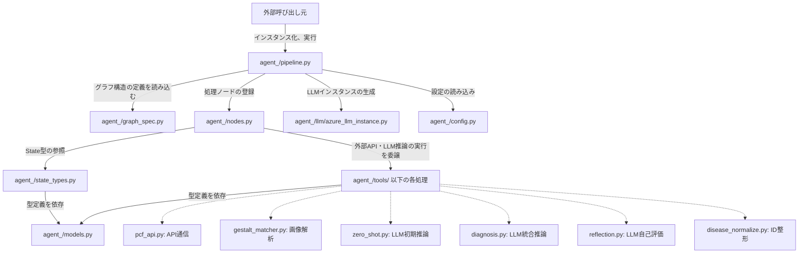

# RefactoredAgent

## 1. コアエンジン (agent_/pipeline.py)

システム全体を制御する **RefactoredRareDiseaseDiagnosisPipeline** クラスが定義されています。

* **__init__**: モデル名（デフォルトは **gpt-4o**）やログ出力の有無、環境変数（設定）を読み込みます。ここでLLMのインスタンス化とグラフの構築（**_build_graph**）を行います。
* **_wrap_node(node_name, node_func)**: 非常に重要な関数です。生のノード関数を直接LangGraphに登録するのではなく、この関数でラップ（包み込む）します。
    * **目的1（トレース）**: 処理の開始時間と終了時間をStateの **nodeTrace** に記録します。
    * **目的2（エラーハンドリング）**: 外部API通信などでエラーが発生してもプログラムが強制終了しないよう **try-except** で保護します。エラー時は **_fallback_for** 関数を呼んで「空の安全なデータ（フォールバック値）」をStateに返します。
* **run(...)**: クライアントから呼び出される実行用メソッドです。引数を受け取り、初期状態のState（**_build_initial_state**）を生成してグラフの実行（**self.graph.invoke**）を開始します。

---

## 2. グラフ構造の定義 (agent_/graph_spec.py)

グラフの遷移ルールを切り出したファイルです。

* **GRAPH_EDGES**: ノード間の接続をリスト形式で定義しています。**(["A", "B"], "C")** のような記法は、「AとBの両方の処理が完了するのを待ってからCを実行する」という同期（Join）の役割を果たします。
* **route_after_reflection(state)**: リフレクション（自己評価）直後に呼ばれる条件分岐ロジックです。
    * State内の **depth**（現在のループ回数）と **maxDepth**（最大許容回数）を比較し、上限に達していれば強制的に終了フェーズ（**to_final**）へ移行します。
    * 上限未満の場合、リフレクション結果（**reflection.ans**）をチェックし、**Correctness** が **True** なものが1つでもあれば終了へ、すべて **False** であれば **begin_flow**（最初）に戻して推論をやり直させます。

---

## 3. 中継ハブ (agent_/nodes.py)

LangGraphの各ノードとして登録される関数の集まりです。引数として **State** を受け取り、更新する差分を辞書形式で返します。

* **各種 *_node 関数**: 基本的に **tools/** 以下の関数を呼び出すだけですが、データが存在しない場合は早期リターンを行い、不要なAPI呼び出しを防ぎます。
* **reflection_node**: ここには特筆すべき実装上の工夫があります。
    * 疾患候補に対して「それが本当に妥当か？」をLLMに検証させます。
    * **concurrent.futures.ThreadPoolExecutor** を使用し、最大10個のLLMリクエストをマルチスレッドで並列送信しています。また、**TimeoutError** を補足し、一定時間応答がない検証は切り捨てることでシステム全体の遅延を防いでいます。

---

## 4. 状態管理と型定義 (agent_/state_types.py & models.py)

データの構造を厳密に定義することで、バグを防ぎ、LLMの出力フォーマットを安定させています。

* **State (state_types.py)**: **TypedDict** を用いて、グラフ内を巡回するデータの構造を定義しています。**Optional** や **List** が明確に記述されており、各ノードがどのデータを参照・更新すべきかが可視化されています。
* **models.py**: Pydanticの **BaseModel** を用いて、LLMからの構造化出力（JSON）のスキーマや、APIレスポンスの型を定義しています。
    * 例: **DiagnosisOutput** は暫定診断の結果フォーマット。**ReflectionOutput** は妥当性検証のフォーマット（**Correctness** という真偽値を含む）を定義しています。

---

## 5. LLMの管理 (agent_/llm/llm_wrapper.py)

LangChainの **AzureChatOpenAI** をより使いやすくするためのラッパークラスです。

* **AzureOpenAIWrapper クラス**: モデル名（**gpt-4o** や **o1** 系など）によって、LLMに渡すべきパラメータが変わる問題を **_create_llm** メソッド内で吸収しています。
* **get_structured_llm**: Pydanticモデルを渡し、そのスキーマに完全一致するJSONをLLMに返答させるためのメソッドです。

---

## 6. ツール群 (agent_/tools/)

具体的なビジネスロジックをカプセル化したファイル群です。

* **pcf_api.py / gestalt_matcher.py**: 外部の医療系APIにリクエストを投げ、結果をパースして使いやすい形式に変換します。
* **zero_shot.py**: 外部APIの結果を使わず、患者の初期症状（HPO）のみからLLMの純粋な知識だけで診断候補を挙げさせます。
* **diagnosis.py**: すべてのデータ（PCF結果、Gestalt結果、Zero-shot結果など）を統合して一つの巨大なプロンプトを作成し、LLMに総合的な暫定診断を下させます。
* **disease_normalize.py**: 疾患ID（OMIM）の表記揺れ（"OMIM:1234" や "1234"）から接頭辞を削除し、純粋な数値のIDに正規化・統一します。

  
